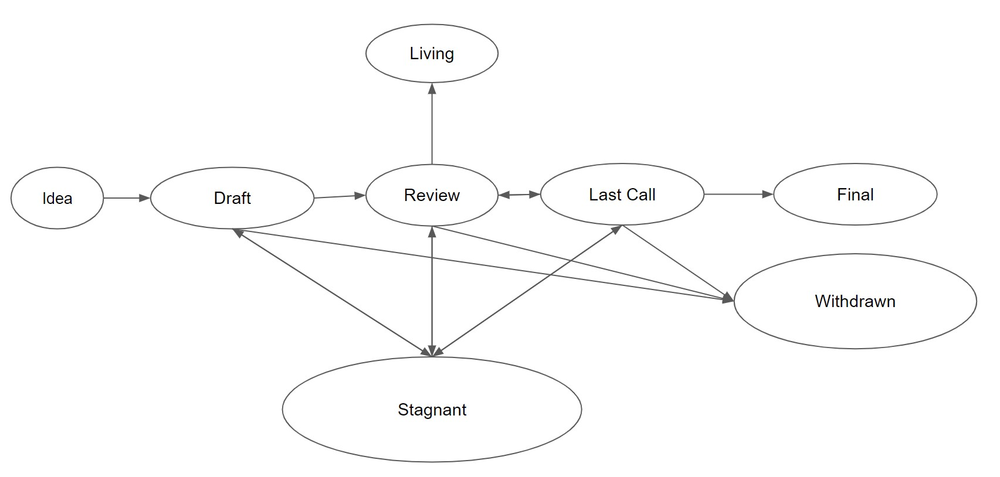

## What is a NIP?

NIP stands for NodeDAO Improvement Proposal, not the shorthand of nipple. A NIP is a design document providing information to the NodeDAO community, or describing a new feature for NodeDAO or its processes or environment. The NIP should provide a concise technical specification of the feature and a rationale for the feature. The NIP author is responsible for building consensus within the community and documenting dissenting opinions.

## NIP Rationale

We intend NIPs to be the primary mechanisms for proposing new features, for collecting community technical input on an issue, and for documenting the design decisions that have gone into NodeDAO. Because the NIPs are maintained as text files in a versioned repository, their revision history is the historical record of the feature proposal.

## NIP Types

There are 3 types of NIPs:
- A **Standards Track NIP** describes any change that affects NodeDAO implementations, such as—a change to the smart contract, a change in fees, proposed application standards/conventions, or any change or addition that affects the interoperability of applications using NodeDAO protocol. Standards Track NIPs consist of two parts—a design document, and an implementation. Furthermore, Standards Track NIPs can be broken down into the following categories:
  - **Core**: improvements requiring an upgrade of the contracts, including updating of contract parameters such as fees & comissions, and recovery action against an attack.
  - **Oracle**: includes improvements around oracle implementation.
  - **NRC**: application-level standards and conventions, including contract standards such as token standards, operator registries and library/package formats.

- A **Meta NIP** describes a process surrounding NodeDAO or proposes a change to (or an event in) a process. Process NIPs are like Standards Track NIPs but apply to areas other than the NodeDAO protocol itself. They may propose an implementation, but not to NodeDAO's codebase; they often require community consensus; unlike Informational NIPs, they are more than recommendations, and users are typically not free to ignore them. Examples include procedures, guidelines, changes to the decision-making process, and changes to the tools or environment used in NodeDAO development. Any meta-NIP is also considered a Process NIP.

- An **Informational NIP** describes an NodeDAO design issue, or provides general guidelines or information to the NodeDAO community, but does not propose a new feature. Informational NIPs do not necessarily represent NodeDAO community consensus or a recommendation, so users and implementers are free to ignore Informational NIPs or follow their advice.

It is highly recommended that a single NIP contain a single key proposal or new idea. The more focused the NIP, the more successful it tends to be.

A NIP must meet certain minimum criteria. It must be a clear and complete description of the proposed enhancement. The enhancement must represent a net improvement. The proposed implementation, if applicable, must be solid and must not complicate the protocol unduly.

## NIP Work Flow

### Shepherding a NIP

Parties involved in the process are you, the champion or *NIP author*, the [*NIP editors*](#nip-editors), and the [*NodeDAO Core Developers*](https://github.com/King-Hash-Org/NodeDAO-Protocol/graphs/contributors).

Before you begin writing a formal NIP, you should vet your idea. Ask the NodeDAO community first if an idea is original to avoid wasting time on something that will be rejected based on prior research. It is thus recommended to open a discussion thread on NodeDAO discord to do this.

Once the idea has been vetted, your next responsibility will be to present (by means of an NIP) the idea to the reviewers and all interested parties, invite editors, developers, and the community to give feedback on the aforementioned channels. You should try and gauge whether the interest in your NIP is commensurate with both the work involved in implementing it and how many parties will have to conform to it. For example, the work required for implementing a Core NIP will be much greater than for an NRC and the NIP will need sufficient interest from core NodeDAO developers. Negative community feedback will be taken into consideration and may prevent your NIP from moving past the Draft stage.

### Core NIPs

For Core NIPs, given that they require contract implementations to be considered **Final** (see "NIPs Process" below), you will need to either provide an implementation or convince core developers to implement your NIP.

The best way to get core developers to review your NIP is to present it on an AllCoreDevs call. You can request to do so by posting a comment linking your NIP on NodeDAO discord.  

:warning: The NIPs process and AllCoreDevs call were not designed to address contentious non-technical issues, but, due to the lack of other ways to address these, often end up entangled in them. This puts the burden on core developers to try and gauge community sentiment, which hinders the technical coordination function of NIPs and AllCoreDevs calls. If you are shepherding a NIP, you can make the process of building community consensus easier by making sure that NodeDAO discord thread for your NIP includes or links to as much of the community discussion as possible and that various stakeholders are well-represented.

*In short, your role as the champion is to write the NIP using the style and format described below, shepherd the discussions in the appropriate forums, and build community consensus around the idea.*

### NIP Process

The following is the standardization process for all NIPs in all tracks:

**Idea** - An idea that is pre-draft. This is not tracked within the NIP Repository.

**Draft** - The first formally tracked stage of an NIP in development. A NIP is merged by a NIP Editor into the NIP repository when properly formatted.

**Review** - An NIP Author marks a NIP as ready for and requesting Peer Review.

**Last Call** - This is the final review window for a NIP before moving to `Final`. An NIP editor will assign `Last Call` status and set a review end date (`last-call-deadline`), typically 21 days later.

If this period results in necessary normative changes it will revert the NIP to `Review`.

**Final** - This NIP represents the final standard. A Final NIP exists in a state of finality and should only be updated to correct errata and add non-normative clarifications.

**Stagnant** - Any NIP in `Draft` or `Review` or `Last Call` if inactive for a period of 6 months or greater is moved to `Stagnant`. A NIP may be resurrected from this state by Authors or NIP Editors through moving it back to `Draft` or it's earlier status. If not resurrected, a proposal may stay forever in this status.

>*NIP Authors are notified of any algorithmic change to the status of their NIP*

**Withdrawn** - The NIP Author(s) have withdrawn the proposed NIP. This state has finality and can no longer be resurrected using this NIP number. If the idea is pursued at later date it is considered a new proposal.

**Living** - A special status for NIPs that are designed to be continually updated and not reach a state of finality. This includes most notably NIP-1.

## What belongs in a successful NIP?

Each NIP should have the following parts:

- Preamble - RFC 822 style headers containing metadata about the NIP, including the NIP number, a short descriptive title (limited to a maximum of 44 characters), a description (limited to a maximum of 140 characters), and the author details. Irrespective of the category, the title and description should not include NIP number. See [below](./nip-1.md#nip-header-preamble) for details.
- Abstract - Abstract is a multi-sentence (short paragraph) technical summary. This should be a very terse and human-readable version of the specification section. Someone should be able to read only the abstract to get the gist of what this specification does.
- Motivation *(optional)* - A motivation section is critical for NIPs that want to change the NodeDAO protocol. It should clearly explain why the existing protocol specification is inadequate to address the problem that the NIP solves. This section may be omitted if the motivation is evident.
- Specification - The technical specification should describe the syntax and semantics of any new feature.
- Rationale - The rationale fleshes out the specification by describing what motivated the design and why particular design decisions were made. It should describe alternate designs that were considered and related work, e.g. how the feature is supported in other languages. The rationale should discuss important objections or concerns raised during discussion around the NIP.
- Backwards Compatibility *(optional)* - All NIPs that introduce backwards incompatibilities must include a section describing these incompatibilities and their consequences. The NIP must explain how the author proposes to deal with these incompatibilities. This section may be omitted if the proposal does not introduce any backwards incompatibilities, but this section must be included if backward incompatibilities exist.
- Test Cases *(optional)* - Test cases for an implementation are mandatory for NIPs that are affecting consensus changes. Tests should either be inlined in the NIP as data (such as input/expected output pairs, or included in `../assets/nip-###/<filename>`. This section may be omitted for non-Core proposals.
- Reference Implementation *(optional)* - An optional section that contains a reference/example implementation that people can use to assist in understanding or implementing this specification. This section may be omitted for all NIPs.
- Security Considerations - All NIPs must contain a section that discusses the security implications/considerations relevant to the proposed change. Include information that might be important for security discussions, surfaces risks and can be used throughout the life-cycle of the proposal. E.g. include security-relevant design decisions, concerns, important discussions, implementation-specific guidance and pitfalls, an outline of threats and risks and how they are being addressed. NIP submissions missing the "Security Considerations" section will be rejected. An NIP cannot proceed to status "Final" without a Security Considerations discussion deemed sufficient by the reviewers.
- Copyright Waiver - All NIPs must be in the public domain. The copyright waiver MUST link to the license file and use the following wording: `Copyright and related rights waived via [CC0](../LICENSE.md).`

## NIP Formats and Templates

NIPs should be written in [markdown](https://github.com/adam-p/markdown-here/wiki/Markdown-Cheatsheet) format. There is a [template](https://github.com/King-Hash-Org/NIPs/blob/master/nip-template.md) to follow.

## NIP Header Preamble

Each NIP must begin with an [RFC 822](https://www.ietf.org/rfc/rfc822.txt) style header preamble, preceded and followed by three hyphens (`---`). This header is also termed ["front matter" by Jekyll](https://jekyllrb.com/docs/front-matter/). The headers must appear in the following order.

`nip`: *NIP number* (this is determined by the NIP editor)

`title`: *The NIP title is a few words, not a complete sentence*

`description`: *Description is one full (short) sentence*

`author`: *The list of the author's or authors' name(s) and/or username(s), or name(s) and email(s). Details are below.*

`discussions-to`: *The url pointing to the official discussion thread*

`status`: *Draft, Review, Last Call, Final, Stagnant, Withdrawn, Living*

`last-call-deadline`: *The date last call period ends on* (Optional field, only needed when status is `Last Call`)

`type`: *One of `Standards Track`, `Meta`, or `Informational`*

`category`: *One of `Core`, `Networking`, `Interface`, or `NRC`* (Optional field, only needed for `Standards Track` NIPs)

`created`: *Date the NIP was created on*

`requires`: *NIP number(s)* (Optional field)

`withdrawal-reason`: *A sentence explaining why the NIP was withdrawn.* (Optional field, only needed when status is `Withdrawn`)

Headers that permit lists must separate elements with commas.

Headers requiring dates will always do so in the format of ISO 8601 (yyyy-mm-dd).

### `author` header

The `author` header lists the names, email addresses or usernames of the authors/owners of the NIP. Those who prefer anonymity may use a username only, or a first name and a username. The format of the `author` header value must be:

> Random J. User &lt;address@dom.ain&gt;

or

> Random J. User (@username)

if the email address or GitHub username is included, and

> Random J. User

if the email address is not given.

It is not possible to use both an email and a GitHub username at the same time. If important to include both, one could include their name twice, once with the GitHub username, and once with the email.

At least one author must use a GitHub username, in order to get notified on change requests and have the capability to approve or reject them.

### `discussions-to` header

While a NIP is a draft, a `discussions-to` header will indicate the URL where the NIP is being discussed.

The preferred discussion URL is a topic on NodeDAO discord. The URL cannot point to Github pull requests, any URL which is ephemeral, and any URL which can get locked over time (i.e. Reddit topics).

### `type` header

The `type` header specifies the type of NIP: Standards Track, Meta, or Informational. If the track is Standards please include the subcategory (core, networking, interface, or NRC).

### `category` header

The `category` header specifies the NIP's category. This is required for standards-track NIPs only.

### `created` header

The `created` header records the date that the NIP was assigned a number. Both headers should be in yyyy-mm-dd format, e.g. 2001-08-14.

### `requires` header

NIPs may have a `requires` header, indicating the NIP numbers that this NIP depends on. If such a dependency exists, this field is required.

A `requires` dependency is created when the current NIP cannot be understood or implemented without a concept or technical element from another NIP. Merely mentioning another NIP does not necessarily create such a dependency.

## Linking to other NIPs

References to other NIPs should follow the format `NIP-N` where `N` is the NIP number you are referring to.  Each NIP that is referenced in an NIP **MUST** be accompanied by a relative markdown link the first time it is referenced, and **MAY** be accompanied by a link on subsequent references.  The link **MUST** always be done via relative paths so that the links work in this GitHub repository, forks of this repository, the main NIPs site, mirrors of the main NIP site, etc.  For example, you would link to this NIP as `./nip-1.md`.

## Auxiliary Files

Images, diagrams and auxiliary files should be included in a subdirectory of the `assets` folder for that NIP as follows: `assets/nip-N` (where **N** is to be replaced with the NIP number). When linking to an image in the NIP, use relative links such as `../assets/nip-1/image.png`.

## Transferring NIP Ownership

It occasionally becomes necessary to transfer ownership of NIPs to a new champion. In general, we'd like to retain the original author as a co-author of the transferred NIP, but that's really up to the original author. A good reason to transfer ownership is because the original author no longer has the time or interest in updating it or following through with the NIP process, or has fallen off the face of the 'net (i.e. is unreachable or isn't responding to email). A bad reason to transfer ownership is because you don't agree with the direction of the NIP. We try to build consensus around an NIP, but if that's not possible, you can always submit a competing NIP.

If you are interested in assuming ownership of an NIP, send a message asking to take over, addressed to both the original author and the NIP editor. If the original author doesn't respond to the email in a timely manner, the NIP editor will make a unilateral decision (it's not like such decisions can't be reversed :)).

## NIP Editors

The current NIP editors are

- Tom (@Tom-OriginStorage)
- Derrick (@derricktan23)
- Kenneth (@DarkArtistry)
- Dong Dong (@nobsu)

## NIP Editor Responsibilities

For each new NIP that comes in, an editor does the following:

- Read the NIP to check if it is ready: sound and complete. The ideas must make technical sense, even if they don't seem likely to get to final status.
- The title should accurately describe the content.
- Check the NIP for language (spelling, grammar, sentence structure, etc.), markup (GitHub flavored Markdown), code style

If the NIP isn't ready, the editor will send it back to the author for revision, with specific instructions.

Once the NIP is ready for the repository, the NIP editor will:

- Assign an NIP number (generally the PR number, but the decision is with the editors)
- Merge the corresponding [pull request](https://github.com/King-Hash-Org/NIPs/pulls)
- Send a message back to the NIP author with the next step.

Many NIPs are written and maintained by developers with write access to the NodeDAO codebase. The NIP editors monitor NIP changes, and correct any structure, grammar, spelling, or markup mistakes we see.

The editors don't pass judgment on NIPs. We merely do the administrative & editorial part.

## Style Guide

### Titles

The `title` field in the preamble:

- Should not include the word "standard" or any variation thereof; and
- Should not include the NIP's number.

### Descriptions

The `description` field in the preamble:

- Should not include the word "standard" or any variation thereof; and
- Should not include the NIP's number.

### NIP numbers

When referring to an NIP by number, it should be written in the hyphenated form `NIP-X` where `X` is the NIP's assigned number.

### RFC 2119 and RFC 8174

NIPs are encouraged to follow [RFC 2119](https://www.ietf.org/rfc/rfc2119.html) and [RFC 8174](https://www.ietf.org/rfc/rfc8174.html) for terminology and to insert the following at the beginning of the Specification section:

> The key words "MUST", "MUST NOT", "REQUIRED", "SHALL", "SHALL NOT", "SHOULD", "SHOULD NOT", "RECOMMENDED", "NOT RECOMMENDED", "MAY", and "OPTIONAL" in this document are to be interpreted as described in RFC 2119 and RFC 8174.

## History

This document was derived heavily from [Bitcoin's BIP-0001](https://github.com/bitcoin/bips) written by Amir Taaki which in turn was derived from [Python's PEP-0001](https://peps.python.org/). In many places text was simply copied and modified. Although the PEP-0001 text was written by Barry Warsaw, Jeremy Hylton, and David Goodger, they are not responsible for its use in the NodeDAO Improvement Process, and should not be bothered with technical questions specific to NodeDAO or the NIP. Please direct all comments to the NIP editors.

## Copyright

Copyright and related rights waived via [CC0](../LICENSE.md).
